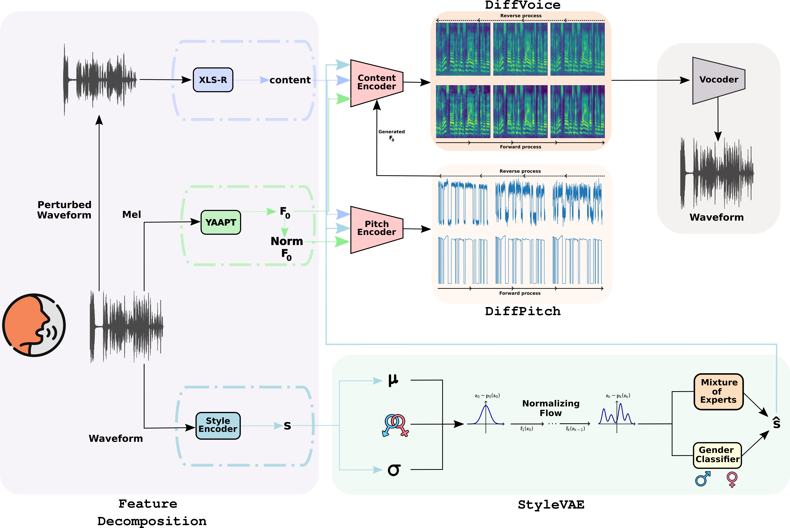

# DIVAS-FL: Diffusion-based Implicit Voice editing via Autoencoder-guided Style transfer in Federated Learning

##  Abstract
Voice-based technologies deployed on consumer devices operate under strict privacy and computational constraints, which limit the use of centralized data and demand decentralized learning approaches. In this context, combining controlled voice generation with federated learning offers a promising strategy to enhance model performance without compromising user data. This work presents a generative framework that integrates controlled voice synthesis with Federated Learning. A style-aware generative model, based on a hierarchical diffusion process and a latent Style-aware Variational Autoencoder, is pre-trained centrally and then adapted locally to produce diverse synthetic voices conditioned on speaker gender. Clients fine-tune specific model components with their own data, enabling personalized style control while preserving privacy and operating within constrained computational budgets. Integrated into a federated training scheme, the system enhances style adaptation of transformed speech, while ensuring that sensitive voice data remains decentralized.


**Figure**. DIVAS Framework for voice editing based on Style-VAE.

## Requirements
To set up the environment for global model evaluation, create a python environment using the provided DIVAS-FL.yml file:
```bash
conda env create -f DIVAS-FL.yml
conda activate DIVAS-FL_env
```

## Data Organization
### Dataset
Data in the folder '$your_folder/data' are provided as an example. Prepare your own dataset following this format. In order to obtain files related to the pitch (f0 and f0_norm), use the YAAPT algorithm.
```bash
data
├──train
    ├──id00001
        ├──audio
            └──*.wav
        ├──f0
            └──*.pt 
        ├──f0_norm
            └──*.pt
        └──gender.txt
    ├──id00002
        ├──audio
            └──*.wav
        ├──f0
            └──*.pt
        ├──f0_norm
            └──*.pt
        └──gender.txt
    ...
└──test
    ├──id00001
        └──audio
            └──*.wav
        ├──f0
            └──*.pt
        ├──f0_norm
            └──*.pt
        └──gender.txt
    ├──id00002
        ├──audio
            └──*.wav
        ├──f0
            └──*.pt
        ├──f0_norm
            └──*.pt
        └──gender.txt
    ...
```
### List
To streamline the training and inference process, filelists located in the '$your_folder/run_txt' directory are provided. 
These text files contain relative paths to the files in the dataset and are used by the pipeline to locate the data (audio, f0, f0_norm). An example is provided.
```bash
run_text
└──centralized
    ├──train_wav.txt
        └──../data/train/id00001/audio/00001.wav
    ├──train_f0.txt
        └──../data/train/id00001/f0/00001.pt
    ├──train_f0_norm.txt
        └──../data/train/id00001/f0_norm/00001.pt
    ├──test_wav.txt
        └──../data/test/id00001/audio/00001.wav
    ├──test_f0.txt
        └──../data/test/id00001/f0/00001.pt
    └──test_f0_norm.txt
        └──../data/test/id00001/f0_norm/00001.pt
```
The user can generate these filelists by using '$your_folder/create_list.py'

## Training (centralized)
To train the model in a centralized setting, use the script below.
All hyperparameters and training settings are defined in the corresponding config file.
The following is an example command:

```bash
python run_centralized.py --config configs/config_centralized.json --vocoder hifigan
```

## Federated Learning- Fine-Tuning
To fine-tune the model in a federated learning setup, start by running the server process.
You can choose your own hyperparameters (e.g., number of rounds, number of clients).
An example command is shown below:

```bash
python run_server.py --num_rounds 10 --min_available_clients 5 --min_fit_clients 5 --data_path ./run_txt/server --device cuda:0
```

Then, start one or more clients, each with its own client ID.
Also in this case, you can configure hyperparameters.

```bash
CUDA_VISIBLE_DEVICES=1 python run_client.py --client_id client_1 --data_path ./run_txt --epochs 10
```

## Inference
To run inference, use the '$your_folder/inference.py' script.

### Key argument
* target: defines which model to use for inference, either 'pretrained_server' or 'server'
* flag: enables the generation. If omitted, evaluate the generated data.

An example command is provided below:
```bash
python inference.py --config configs/config_server.json --vocoder hifigan --target server --flag
```

## Data Availability

This work makes use of the following publicly available audio datasets (last accessed July 2025):

- [**VoxCeleb1**](https://www.robots.ox.ac.uk/~vgg/data/voxceleb/vox1.html)
- [**VoxCeleb2**](https://www.robots.ox.ac.uk/~vgg/data/voxceleb/vox2.html)

These datasets contain speech from thousands of speakers extracted from YouTube videos.

Please refer to the [official VoxCeleb website](https://www.robots.ox.ac.uk/~vgg/data/voxceleb/) for license and usage details.

## Acknowledgments
This work was partially supported by PNRR Centro Nazionale HPC, Big Data e Quantum Computing, (CN 00000013) (CUP: E63C22000980007).
